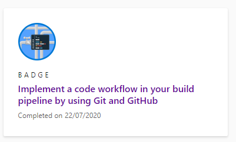
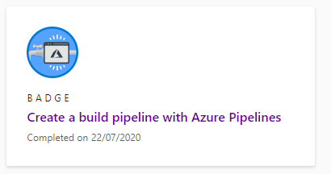
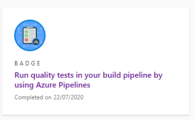

# Devops-MSA2020

**Deployed website:** https://devops-msa2020.azurewebsites.net/

Microsoft learn completed modules

**Description:**

This is a simple build release pipeline that is very similar to the MSA2020 tutorial.
Building the pipeline, it was linked to my github account so that whenever I push a commit
to the master the pipeline will run. It also enables me to pre-install tools to my project 
(in this case it was node.js).It also runs automated tests to ensure my code is working.
The react web app uses the release pipeline to deploy the web app using the azure services. 

